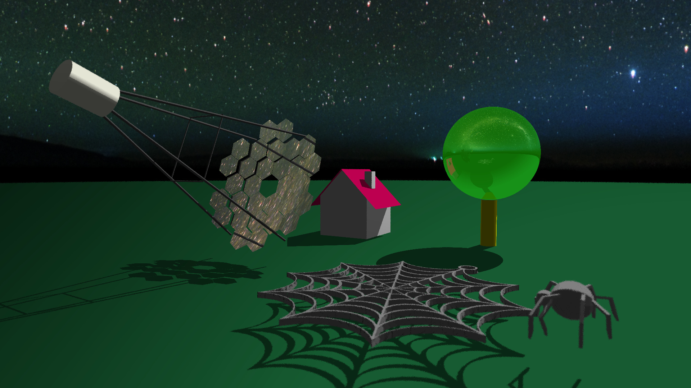

# mctracer

[](https://www.gnu.org/licenses/gpl-3.0)

scientific photon propagation and ray tracing in complex sceneries


## installation on Ubuntu

### tools needed
* git
* g++ >= 5.3
* cmake

### dependencies
* libopencv-dev >= 2.4.8
* OpenMP

opencv can be installed with apt-get when running Ubuntu >= 14. Otherwise one has to install it locally by hand. This is easiest done by getting it from the git repo: https://github.com/itseez/opencv

then, for instance
```bash
cd ~/opencv
mkdir release
cd release
cmake -D CMAKE_BUILD_TYPE=RELEASE -D CMAKE_INSTALL_PREFIX=/your/favorite/path ..
make && make install

```
Last thing is to export $OpenCV_DIR to the CMAKE_INSTALL_PREFIX, if it is not /usr/local e.g.:
```bash
export OpenCV_DIR=<CMAKE_INSTALL_PREFIX>
```
This ensures that CMakeLists.txt finds the correct version of OpenCV.

### make
```
git clone https://github.com/TheBigLebowSky/mctracer.git
mkdir build
```
The /build directory is best located side by side to the /mctracer directory.

```bash
cd build
cmake ../mctracer
make
```

## run mctracer
The mctracer has several executeables. To interacively explore a scenery use mctShow.
```bash
mctShow --scenery fact.xml
```

## Unit Tests
Run the unit tests in the mctracer/Tests directory to ensure your build is fine.

```bash
cd mctracer/Tests
../../build/mctTest
```
